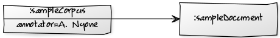

#Quick User guide

This article gives a brief overview over the Java API of the linguistic meta model Salt and explains how to use and how to work with it's model elements. We only describe the use of the meta model SaltCommon here, which is one of three meta models coming with the Salt project. 
For giving a short but concise feeling of what Salt is made for, we give an example in Java Code, followed by explanations. The description exemplifies the creation of a new corpus, starting from modeling it's structure, the primary data, the tokenization, adding annotations, hierarchies and so on. At the end of this article, we show how such a corpus model can be stored into SaltXML and loaded into main memory again. We also provide a sample project as part of Salt. This sample project is located in salt-saltCommon under the package de.hu_berlin.german.korpling.saltnpepper.salt.samples . Take a look into the source code to get more code examples.

Salt is a graph-based meta model, and therefore each model element in Salt is either a node, an edge (relation), a graph, a label or a layer. This means nodes can be connected via relations. Nodes and relations are contained in a graph. They also can be contained in layers, which define kinds of sub-graphs. A layer itself is also contained in a graph. Each element can be labeled, and even a label can be labeled by another label.

### The Sample

In this article, we present only a very simple example to show the main components of Salt in a very brief way. The example is just used to clarify the mechanisms of Salt and therefore does not claim to advocate to a specific linguistic school. In general, Salt is able to contain very complex corpus structures (which means the inner organization of a corpus), having a recursive sub-corpus - super-corpus structure with a lot of primary data. For simplifying the example, we decided to use just a single corpus object (which is also the root corpus) containing one document. The document contains the primary text "Is this example more complicated than it appears to be?".  After showing how to create a corpus structure in section [Corpus Structure](#corpusStructure), we show a tokenization of the primary text by adding one token for each word of that sentence in [Tokenization](#tokenization). We illustrate how to annotate these words with part-of-speech and lemma annotations. In [Hierarchies](#hierarchies), we show the modeling of higher hierarchies having a part-of relationship in Salt, we decided to model a syntax analysis above the given sentence.  In Salt, there also exists a second way of creating aggregations of tokens called 'spans'. The semantics of spans is slightly different compared to that of hierarchies. In contrast to hierarchies, spans aggregate tokens to a set to be annotated once. You might, for instance, not want to annotate a single token only, but a whole structure containing a set of possibly discontinuous tokens. The use of spans is shown in [Spans](#spans) and demonstrated with the use case of an information structure analysis. The last type of model elements we show here is a loose relation or edge between tokens and/or other structures called pointing relation. To show the use of pointing relations in [Pointing Relations](#pointingRelations), we use an anaphoric annotation to connect the word "it" with the words "this example". 

At last we show how to persist and load a model to disk in [Persist and Load](#persistAndLoad) and we show how to traverse the document structure.


### <a name="corpusStructure">Corpus Structure</a>

Due to it´s graph-based structure, even sub- and super-corpora are modeled as nodes having relations connecting them and creating a containment relationship. The only element not following the graph approach is the element _SaltProject_. This element serves as container for a set of corpus structures represented via the model element _SCorpusGraph_. Such a corpus structure is organized as a graph and contains corpora and documents. Salt distinguishes between a corpus (which can contain other corpora and documents) and documents (which only contain the document structure). The document structure itself is organized as a graph called _SDocumentGraph_. The _SDocumentGraph_ is the element containing the primary data and the linguistic analysis. The corpus structure is just for organizing a complex linguistic project. A corpus in Salt is represented by the element _SCorpus_ and a document is represented by the element _SDocument_. 
In this section, we create a simple corpus structure having one corpus and one document. Since corpora and documents are nodes, they can be labeled. To show this mechanism, we create a meta-annotation, defining the annotator of that corpus. A meta-annotation is represented via the element _SMetaAnnotation_. The corpus structure created here is shown in the figure.



The following snippet shows the creation of the container object _SaltProject_, which shall contain our corpus model:

```java
SaltProject saltProject= SaltFactory.eINSTANCE.createSaltProject();
```

The next snippet illustrates the creation of the corpus structure by creating a corpus graph, a corpus named 'sampleCorpus' and a document named 'sampleDocument'. Afterwards, the creation of the corpus is shown, followed by a meta annotation declaring it´s annotator.

```java
SCorpusGraph sCorpGraph= SaltFactory.eINSTANCE.createSCorpusGraph();
saltProject.getSCorpusGraphs().add(sCorpGraph);
SCorpus sampleCorpus= sCorpGraph.createSCorpus(URI.createURI("/sampleCorpus"));
```

The meta annotation is created via the method _createSMetaAnnotation()_. This method takes three arguments: a nameBLANK which is optional and can be used to take further information, the name of the annotation and the value of the annotation.

```java
//creates a meta annotation on the corpus sampleCorpus
sampleCorpus.createSMetaAnnotation(null, "annotator", "A. Nyone");
```

We now create the document that will later contain a primary text and all of it's annotations. We present two ways of creating a document. First an easier way, where we use helpful methods provided by Salt and second an alternative, where we do it manually.

```java
SDocument sampleDocument= SaltFactory.eINSTANCE.createSDocument();
sampleDocument.setSName("sampleDocument");
//adds the document to the graph and automatically creates an relations between the corpus and the document
sCorpGraph.addSDocument(sampleCorpus, sampleDocument);
```

#### Alternative

In the first snippet, we have not shown the creation of relations between the corpus and the document node. The creation of the relation between them, which is of the type _SCorpusDocumentRelation_, is hidden behind the method _addSDocument(sampleCorpus, sampleDocument)_ and will be created automatically (although it might also be created explicitly). The following snippet will show the same code with explicit creation of the relation.

```java
SDocument sampleDocument= SaltFactory.eINSTANCE.createSDocument();
sampleDocument.setSName("sampleDocument");
//adding document to the graph
sCorpGraph.addSNode(sampleDocument);
//creating relation (edge)
SCorpusDocumentRelation sRelation= SaltFactory.eINSTANCE.createSCorpusDocumentRelation();
//adding source (the corpus) to relation
sRelation.setSCorpus(sampleCorpus);
//adding target (the document) to relation
sRelation.setSDocument(sampleDocument);
//adding the relation to the graph
sCorpGraph.addSRelation(sRelation);
```

### <a name="documentStructure">Document Structure</a>

Now we are leaving the corpus structure and going to the document structure. The difference between both is that the corpus structure groups corpora and documents to super and sub corpora and documents and the document structure contains primary data and their annotations. Therefore we need to add a SDocumentGraph object to the SDocument, which acts as container for the primary data and linguistic annotationns.

```java
sampleDocument.setSDocumentGraph(SaltFactory.eInstance.createSDocumentGraph);
```

### Primary Data

We now show how to add a primary text like "Is this example more complicated than it appears to?" to the document graph. We first show the easy way of creating primary data and than we show the more explicit way.

```java
STextualDS primaryText = sampleDocument.getSDocumentGraph().createSTextualDS("Is this example more complicated than it appears to be?");
```

Even the primary text and in general the primary data in Salt are modelled as nodes with labels. The specific node, which is the container for the primary text is the node _STextualDS_, which is a subclass of _SSequentialDS_. The _String_ representing the text is stored in a label of that node, which can be accessed via _STextualDS.getSText()_ or _STextualDS.setSText(text)_.

#### Alternative

```java
STextualDS primaryText = SaltFactory.eINSTANCE.createSTextualDS();
//setting the primary text to the sentence "Is this example more complicated than it appears to be?"
primaryText.setSText("Is this example more complicated than it appears to?");
//adding the text to the document-graph
sampleDocument.getSDocumentGraph().addSNode(primaryText);
```

### <a name="tokenization">Tokenization</a>

As for some reasons it might be necessary to tokenize a text by yourself. For instance if you don't want to have a word tokenization or for historical text, where separators are missing.

A token in Salt is not bound to a linguistic unit - in this example we show how to tokenize words, although tokenizations by characters, syllables or sentences and so on are possible, too. The following figure shows an excerpt of the document graph we want to model in Salt. The figure only shows the tokens overlapping the words 'Is', 'this', 'example' and '.'.


For tokenizing a primary text, we need the character offset of the start and the end position for each token in the text. The word "Is" in the sample text, for instance, has the start position 0 and the end position 1. Note that the positions are counted **between** two characters.

<table>
<td></td><td>Is</td><td></td><td>BLANK</td><td></td><td>this</td><td></td><td>BLANK</td><td></td><td>example</td><td></td><td>BLANK</td><td></td><td>more</td><td></td><td>BLANK</td><td></td><td>complicated</td><td></td><td>BLANK</td><td></td><td>than</td><td></td><td>BLANK</td><td></td><td>it</td><td></td><td>BLANK</td><td></td><td>appears</td><td></td><td>BLANK</td><td></td><td>to</td><td></td><td>BLANK</td><td></td><td>be</td><td></td><td>?</td><td></td>
</tr>
<tr>
<td>
0</td><td></td><td>2</td><td></td><td>3</td><td></td><td>7</td><td></td><td>8</td><td></td><td>15</td><td></td><td>16</td><td></td><td>20</td><td></td><td>21</td><td></td><td>32</td><td></td><td>33</td><td></td><td>37</td><td></td><td>38</td><td></td><td>40</td><td></td><td>41</td><td></td><td>48</td><td></td><td>49</td><td></td><td>51</td><td></td><td>52</td><td></td><td>54</td><td>55</td>
</tr>
</table>

In the given table BLANK is an alias for the blank character (' ').

Salt provides a tokenizer to tokenize a primary text. This tokenizer is along the TreeTaggers tokenizer (see: http://www.cis.uni-muenchen.de/~schmid/tools/TreeTagger/). The tokenizer uses blanks and punctuations (regarding abbreviations) and so on to separate words. The using of the tokenizer is quite simple as the following snippet shows: 

```java
sampleDocument.getSDocumentGraph().tokenize();
```
To access the created tokens you can iterate over the token's list:

```java
sampleDocument.getSDocumentGraph().getSTokens();
```

or token by token:

```java
sampleDocument.getSDocumentGraph().getSTokens().get(0);
```

In the following snippet we show an example of creating a tokenization manually by creating just one token. The creation of all other tokens is done in the same manner. 

```java
//creating tokenization for the token 'Is' 
SToken tok_is= sampleDocument.getSDocumentGraph().createSToken(primaryText, 0, 2);
SToken tok_this= sampleDocument.getSDocumentGraph().createSToken(primaryText, 3, 7);
SToken tok_example= sampleDocument.getSDocumentGraph().createSToken(primaryText, 8, 15);
SToken tok_more= sampleDocument.getSDocumentGraph().createSToken(primaryText, 16, 20);
SToken tok_complicated= sampleDocument.getSDocumentGraph().createSToken(primaryText, 21, 32);
SToken tok_than= sampleDocument.getSDocumentGraph().createSToken(primaryText, 33, 37);
SToken tok_it= sampleDocument.getSDocumentGraph().createSToken(primaryText, 38, 41);
SToken tok_appears= sampleDocument.getSDocumentGraph().createSToken(primaryText, 42, 48);
SToken tok_to= sampleDocument.getSDocumentGraph().createSToken(primaryText, 49, 51);
SToken tok_be= sampleDocument.getSDocumentGraph().createSToken(primaryText, 52, 54);
SToken tok_PUNC= sampleDocument.getSDocumentGraph().createSToken(primaryText, 54, 55);
```

Now the token will be added to the morphology layer. A layer in Salt is represented by the element _SLayer_ and defines a kind of a sub-graph, for instance for clustering nodes to a specific linguistic analysis. The snippet also shows the annotation of tokens with part-of-speech and lemma annotations using the element _SAnnotation_.

```java
//creating a layer named morphology
SLayer morphLayer = SaltFactory.eINSTANCE.createSLayer();
morphLayer.setSName("morphology");
sampleDocument.getSDocumentGraph().addSLayer(morphLayer);

//adding the new token to the morphology layer
morphLayer.getSNodes().add(tok_is);
//adding a part-of-speech annotation to the new token
tok_is.createSAnnotation(null, "pos", "VBZ");
//adding a lemma annotation to the new token
tok_is.createSAnnotation(null, "lemma", "be");

//...
```

Again, we did not explicitly create the relations: their creation is hidden in the method _createSToken()_. But in the background Salt creates a node of type _SToken_ for the token and a relation called _STextualRelation_ which connects the token and the primary data node. Since Salt does not know any further elements other than the graph elements mentioned, the character positions, to which the tokens refer to are stored as labels of the edges. For such a kind of label we use a special type named _SFeature_. When just working with Salt and not creating an own derived meta model, the mechanism is not important. It is just important, that the positions can be set and retrieved via the methods _STextualRelation.getSStart()_ or _STextualRelation.setSStart(value)_. The same goes for the end position _SEnd_.

### <a name="hierarchies">Hierarchies</a>

In Salt, you can create hierarchies for instance to model syntactic annotations like constituencies. These hierarchies are realized via the node _SStructure_ and can be connected to each other via edges of type _SDominanceRelation_. A relation of that type has the semantics of a part-of relation, which means that the target of that relation is a part of the source of that relation. In this example, we want to create a syntactic analysis as part of a syntactic layer. The following figure shows the structure we will create in this step of the example.

```
                      ROOT-----------------                  
                       |                   \
                -------SQ ---               \
               /    /        \               \
              /    /          ---ADJP--       \
             /    /          /         \       \
            /    /          /           SBar    \
           /    /          /           /    \    \
          /    /          /           /      S    \
         /    /          /           /      / \    \
        /    /          /           /      /   VP   \
       /    /          /           /      /  /   \   \
      /    /          /           /      /   |    S   \
     /    /           |           |     /    |     \   \
    /    /            |           |    /     |      VP  \
   /    NP           ADJA         |    NP    |     /  \  \
  /    /   \       /      \       |    |     |     |  VP |
  |    |   |       |      |       |    |     |     |  |  |
 Is this example more complicated than it appears to be  ?
```

The following snippet gives an impression of how to create that hierarchy. We just show the creation of the left NP node and the SQ node.

```java
//creating a list of nodes, which shall be overlapping by NP-node
EList<SStructuredNode> overlappingNodes= new BasicEList<SStructuredNode>();
overlappingNodes.add(tok_this);
overlappingNodes.add(tok_example);
//adding NP-Node to graph and automatically creating edges to overlapping nodes
SStructure np_1= sampleDocument.getSDocumentGraph().createSStructure(overlappingNodes);
np_1.createSAnnotation(null, "cat", "NP");
				
//...

//creating a list of nodes, which shall be overlapping by SQ-node
overlappingNodes= new BasicEList<SStructuredNode>();
overlappingNodes.add(tok_is);
overlappingNodes.add(np_1);
SStructure sq= sampleDocument.getSDocumentGraph().createSStructure(overlappingNodes);
sq.createSAnnotation(null, "cat", "SQ");
		
//creating a syntax layer
SLayer syntaxLayer = SaltFactory.eINSTANCE.createSLayer();
syntaxLayer.setSName("syntax");
docGraph.addSLayer(syntaxLayer);
		
//adding syntactic nodes to syntax layer
syntaxLayer.getNodes().add(np_1);
syntaxLayer.getNodes().add(sq);
//...
```

For annotating a dominance relation or each other relation, you can access it by querying all edges between two nodes:

```java
((SRelation)getSDocument().getSDocumentGraph().getEdges(np_1.getSId(), tok_is.getSId()).get(0)).createSAnnotation(...);
```

#### Alternative

Alternatively, you can create a hierarchy on step by step. The following snippet examplifies this process for the same sample (the token for 'is' and the SQ node):

```java
SStructure sq= SaltFactory.eINSTANCE.createSStructure();
docGraph.addSNode(sq);
sq.createSAnnotation(null, "cat", "SQ");

SDominanceRelation domRel= SaltFactory.eINSTANCE.createSDominanceRelation();
domRel.setSSource(sq);
domRel.setSTarget(tok_is);
docGraph.addSRelation(domRel);
```

### <a name="spans">Spans</a>

If a whole (possibly discontinuous) set of nodes has to be annotated with the very same annotation, a Span can be used to aggregate the nodes. Instead of an annotation for each node, a single annotation for the Span can be created then. This annotation belongs to the set of nodes (the Span), but not to any of the single nodes. In our example we show the use of spans building an information structure analysis. Spans in Salt are realized by nodes of the type _SSpan_, they are connected to _SToken_ nodes via edges of type _SSpanningRelation_. The following figure shows the information structure analysis to be modeled.


The following snippet shows the code used to create the analysis shown in the figure.


```java
//create span overlaping only one token
SSpan contrast_focus= docGraph.createSSpan(tok_is);
contrast_focus.createSAnnotation(null, "inf-struct", "contrast-focus");
		
//create a list of tokens taking part in the set to be annotated as a bundle
EList<SToken> overlappingTokens= new BasicEList<SToken>();
overlappingTokens.add(tok_this);
overlappingTokens.add(tok_example);
overlappingTokens.add(tok_more);
overlappingTokens.add(tok_complicated);
overlappingTokens.add(tok_than);
overlappingTokens.add(tok_it);
overlappingTokens.add(tok_appears);
overlappingTokens.add(tok_to);
overlappingTokens.add(tok_be);
overlappingTokens.add(tok_PUNC);
	
//create span overlaping a set of tokens	
SSpan topic= docGraph.createSSpan(overlappingTokens);
topic.createSAnnotation(null, "inf-struct", "topic");
```

#### Alternative
Alternatively to using the method createSSpan(...) you can create the span and the corresponding _SSpanningRelations_ on your own. The following snippet gives an impression, how to create the same span as in the last example step by step:

```java
SSpan contrast_focus= SaltFactory.eINSTANCE.createSSpan();
docGraph.addSNode(contrast_focus);
SSpanningRelation spanRel= SaltFactory.eINSTANCE.createSSpanningRelation();
spanRel.setSSource(contrast_focus);
spanRel.setSTarget(tok_is);
docGraph.addSRelation(spanRel);
```


### <a name="pointingRelations">Pointing Relations</a>

Now we will show another type of edge, which renders a more loose relation between nodes. In contrast to _SSpanningRelations_ and _SDominanceRelations_, which can only connect specific kinds of nodes, the type _SPointingRelation_ can connect _SToken_, _SSpan_ and _SStructure_ nodes with each other and vice versa. These edges for instance can be used to model anaphoric relations between words, phrases, sentences and so on. Edges in general can be typed with a linguistic meaning by setting their attribute _SType_. We illustrate that by connecting the token covering the word "it" to the set of tokens "the" and "example". To bundle the words "the" and "example", we first have to create a span covering both tokens "the" and "example" following the same mechanism as shown in section [spans](#spans).


The following snippet shows the creation of the model shown in the figure.

```java
//create a span covering the words "the" and "example"
EList<SToken> overlappingTokens= new BasicEList<SToken>();
overlappingTokens.add(tok_this);
overlappingTokens.add(tok_example);
SSpan span= docGraph.createSSpan(overlappingTokens);

//creating a pointing relations
SPointingRelation sPointingRelation= SaltFactory.eINSTANCE.createSPointingRelation();
//setting token "it" as source of this relation
sPointingRelation.setSStructuredSource(tok_it);
//setting span "this example" as target of this relation
sPointingRelation.setSStructuredTarget(span);
//adding the created relation to the document-graph
sampleDocument.getSDocumentGraph().addSRelation(sPointingRelation);
//adding the type to the relation
sPointingRelation.addSType("anaphoric");
```

### Identifiers in Salt

Each node, edge, graph and layer in Salt gets a unique identifier called _SElementId_. Such an identifier is organized like an URI. The inner structure of a URI is shown here:

```
	[scheme:][//authority][path][?query][#fragment]
```

The scheme of these identifiers is 'salt', in the current version, the Salt ids also does not support an authority or a query. The path is organized following the tree structure of the corpus structure, starting with the name (_SName_ value) of the root corpus, via an unbound number of sub corpora and ends with the document. The identifier for each element is computed automatically by extending the identifier of its parent element. For instance the identifier of a sub corpus named 'corp2' is computed by extending the identifier of its parent corpus 'corp1'. For instance the identifier for a document named 'doc1', being contained in corpus 'corp2', which is contained in corpus 'corp1' (which is the root) would look like this:

```	
       salt:/corp1/corp2/doc1
```

The same mechanism of creating identifiers of the corpus structure is used for elements of the document structure. But the name of these elements is given in the fragment part. Since the content of the document structure is not necessarily a tree-like structure, it is not possible to have a unique path from an element to its root. For instance a token named 'tok1' added to the document having the identifier 'salt/corp1/corp2/doc1' receives the identifier:

```java
	salt:/corp1/corp2/doc1#tok1
```

The same holds for relations. These URI's or _SElementId_'s can be used to identify and search for elements in the corresponding graphs. You can access the id by calling:

```java
tok1.getSElementId();
```

or its String representation by 

```java
tok1.getSId();
```

### <a name="persistAndLoad">Persist and Load a Model<a>

Persisting a model is very easy: only a nonempty _SaltProject_ object and a valid local URI are needed. The following snippet shows how to persist an entire model.

```java
saltProject.saveSaltProject(URI);
```

Please note, that the URI used as parameter is not a URI of type java.net.Uri - it is of type org.eclipse.emf.common.util.URI.

To load a valid SaltXML document, create an empty _SaltProject_ object and call the load method as shown in the following snippet.

```java
saltProject= SaltFactory.eINSTANCE.createSaltProject();
saltProject.loadSaltProject(URI);
```

You can also store and load document structures as shown in the following snippet:
```java
// storing
sampleDocument.saveSDocumentGraph(URI);
// loading
sampleDocument.loadSDocumentGraph(URI);
```

### Accessing a Salt model

To access a Salt model, you can use the methods generated by the Eclipse Modelling Framework (EMF). For attributes and references having the cardinality 1, EMF generates simple getters and setters, i.e. _.getXXX()_ and _.setXXX()_ methods. If attributes do not have a cardinality of 1, the corresponding _.getXXX()_ method will return a list accessor. You can access or manipulate the entries of such a list with these methods:

* _.add(Object)_ to add an entry, 
* _.get(Position)_ to get the object placed at 'Position' in that list, and 
* _.remove(Object)_ to remove an entry.

### Shortcuts

For more complicated accesses which to not concern just two objects, it can be a very long way to get a requested object. Therefore in Salt we offer some shortcuts to have a faster access. For instance for getting the text overlapping by any node, you can write the following code:

```java
docGraph.getSText(sq);
```

Additional shortcuts are provided by the _SDocumentGraph_ class.


### Traversing graphs

When working with Salt, it is often necessary 

* to discover the entire graph, or 
* to discover a sub-graph covered by a given node, or 
* to discover a sub-graph connected by specific types of relations. 

For all of these purposes, we offer the generic possibility to traverse a graph object (e.g. a _SCorpusGraph_ or a _SDocumentGraph_ object). 

A traversal can be done in two directions: __top-down__ and __bottom-up__. When using the top-down method, the traversal will follow the relation direction (e.g. _a_ -> _b>: node _a_ will be visited first, followed by node _b_). When using the bottom-up method, the traversal will follow the inverse of the relation direction (e.g. _a_ -> _b_: node _b_ will be visited before node _a_).

Additionally, you can choose the order in which nodes will be traversed. For this, we provide two modes: __depth-first__ and __breadth-first__. In depth-first mode, the sub-graph of node _b_ will be traversed, before its siblings will be visited. Imagine the following tree structure: 
```
   a
 /   \
 b   d
 |
 c
```

In this case, node _d_ will be visited after _a,b,c_ have been visited. In  breadth-first mode, the order of the traversal is the other way around, i.e.  the nodes _a,b,d_ will be visited before node _c_.

To define the behavior of a traversal, we provide these types, which are combinations of the direction and the order of a traversal:

* de.hu_berlin.german.korpling.saltnpepper.salt.graph.GRAPH_TRAVERSE_TYPE.TOP_DOWN_DEPTH_FIRST
* de.hu_berlin.german.korpling.saltnpepper.salt.graph.GRAPH_TRAVERSE_TYPE.TOP_DOWN_BREADTH_FIRST
* de.hu_berlin.german.korpling.saltnpepper.salt.graph.GRAPH_TRAVERSE_TYPE.BOTTOM_UP_DEPTH_FIRST
* de.hu_berlin.german.korpling.saltnpepper.salt.graph.GRAPH_TRAVERSE_TYPE.BOTTOM_UP_BREADTH_FIRST


The traversal mechanism uses a callback, therefore you need a class implementing the interface _de.hu_berlin.german.korpling.saltnpepper.salt.saltCore.SGraphTraverseHandler_. This interface declares the following three methods, which have to be implemented:

```java
public boolean checkConstraint( GRAPH_TRAVERSE_TYPE traversalType, 
                                String traversalId,
                                SRelation sRelation, 
                                SNode currNode, 
                                long order);

public void nodeReached(        GRAPH_TRAVERSE_TYPE traversalType, 
                                String traversalId,
                                SNode currNode, 
                                SRelation edge, 
                                SNode fromNode, 
                                long order);

public void nodeLeft(           GRAPH_TRAVERSE_TYPE traversalType, 
                                String traversalId,
                                SNode currNode, 
                                SRelation edge, 
                                SNode fromNode, 
                                long order);
```

When the traversal reaches a new node, the method _checkConstraint(...)_ is called. It checks whether the following nodes and their sub-graphs should be processed any further. When this method returns true, the method _nodeReached(...)_ is called next. Before a node is left, the method _nodeLeft(...)_ is called. Note, that the order of the method invocations depends on the traversal type used.

The following example shows the order of calls for the sample graph given in the following figure.


Here, we list the callbacks in correct order in case of a depth-first traversal. We assume that the called object returns true for the method _checkConstraint(...)_ on all nodes except node _span1_. In the case of node _span1_, the _checkConstraint(...)_ method returns  false. Therefore, no _nodeReached(...)_ and _nodeLeft(...)_ method will be called for this node. Note, that the list of parameters of the functions presented here is bigger than shown, e.g. the traversing policy and the edge via which the node has been reached is given, too.

* checkConstraint(struct1)
* nodeReached(struct1)
* checkConstraint(struct2)
* nodeReached(struct2)
* checkConstraint(tok1)
* nodeReached(tok1)
* nodeLeft(tok1)
* checkConstraint(span1)
* nodeLeft(struct2)
* nodeLeft(struct1)


To start the traversal, use the following method, available in any object derived from _SGraph_ (e.g. _SCorpusGraph_ or _SDocumentGraph_):

```java
void traverse(     EList<? extends SNode> startSNodes, 
                   GRAPH_TRAVERSE_TYPE traverseType, 
                   String traverseId, 
                   SGraphTraverseHandler traverseHandler);
```
or

```java
void traverse(     EList<? extends SNode> startSNodes, 
                   GRAPH_TRAVERSE_TYPE traverseType, 
                   String traverseId, 
                   SGraphTraverseHandler traverseHandler, 
                   boolean isCycleSafe);
```


* _startSNodes_ represents a list of nodes, which shall be the entry point for traversal, 
* _traverseType_ is the combination of traversal direction and order explained above, 
* __traverseid__ is an identifier which can be used to identify the specific traversal job (this can be helpful if more than one is running at the same time) and 
* _traverseHandler_, is the object which will be used for callback. 

Additionally, you can set a flag to protect the traversal engine from running in cycles. Per default, this flag is set to __false__ and your _traverseHandler_ has to deal with cyclic graphs itself.
