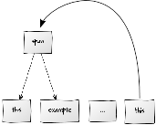

Create a Salt model {#create}
======

In this article, we present a very simple example to show how to create a Salt model in a very brief way. The example is given to clarify the mechanisms of Salt and therefore does not claim to advocate a specific linguistic school. 

### <a name="corpusStructure">Corpus Structure</a>

Due to its graph-based structure, even sub- and super-corpora are modeled as nodes having relations connecting them and creating a containment relationship. The only element not following the graph approach is the element _SaltProject_. This element serves as container for a set of corpus structures represented via the model element _SCorpusGraph_. Such a corpus structure is organized as a graph and contains corpora and documents. Salt distinguishes between a corpus (which can contain other corpora and documents) and documents (which only contain the document structure). The document structure itself is organized as a graph called _SDocumentGraph_. The _SDocumentGraph_ is the element containing the primary data and the linguistic analysis. The corpus structure is just for organizing a complex linguistic project. A corpus in Salt is represented by the element _SCorpus_ and a document is represented by the element _SDocument_. 
In this section, we create a simple corpus structure having one corpus and one document. Since corpora and documents are nodes, they can be labeled. To show this mechanism, we create a meta annotation, defining the annotator of that corpus. A meta annotation is represented via the element _SMetaAnnotation_. The corpus structure created here is shown in the figure below.

The following snippet shows the creation of the container object _SaltProject_, which shall contain our corpus model.

~~~{.java}
SaltProject saltProject= SaltFactory.createSaltProject();
~~~

The next snippet illustrates the creation of the corpus structure by creating a corpus graph, a corpus named 'sampleCorpus' and a document named 'sampleDocument'. Afterwards, the creation of the corpus is shown, followed by a meta annotation declaring its annotator.

~~~{.java}
//creates a new corpus structure
SCorpusGraph corpGraph= saltProject.createCorpusGraph();
//adds a corpus with name sampleCorpus to the corpus structure
SCorpus sampleCorpus= corpGraph.createCorpus(URI.createURI("/sampleCorpus")).get(0);
~~~

The meta annotation is created via the method _createSMetaAnnotation()_. This method takes three arguments: a namespace which is optional and can be used to take up further information, the name of the annotation and the value of the annotation.

~~~{.java}
//creates a meta annotation on the corpus sampleCorpus
sampleCorpus.createMetaAnnotation(null, "annotator", "A. Nyone");
~~~

We now create the document that will later contain a primary text and all of its annotations. We present two ways of creating a document. First an easier way, where we use helpful methods provided by Salt and second an alternative, where we do it manually.

~~~{.java}
//creates a new document named sampleDocument, and adds it as part of sampleCorpus
SDocument sampleDocument=  corpGraph.createDocument(URI.createURI("/sampleCorpus/sampleDocument"));
~~~

#### Alternative

Alternatively you can add an already existing document to the corpus structure and use the <i>addDocument</i> method.
~~~{.java}
SDocument sampleDocument= SaltFactory.createSDocument();
sampleDocument.setName("sampleDocument");
//adds the document to the graph and automatically creates an relations between the corpus and the document
corpGraph.addDocument(sampleCorpus, sampleDocument);</pre>
~~~

### <a name="documentStructure">Document Structure</a>

Now we are leaving the corpus structure and go to the document structure. The difference between both is that the corpus structure groups corpora and documents to super- and sub-corpora and documents, and the document structure contains primary data and their annotations. Therefore we need to add an _SDocumentGraph_ object to the _SDocument_, which acts as container for the primary data and linguistic annotations.

~~~{.java}
sampleDocument.setDocumentGraph(SaltFactory.createSDocumentGraph());
~~~

### Primary Data

We now show how to add a primary text like "Is this example more complicated than it appears to?" to the document graph. We first show the easy way of creating primary data and than we show the more explicit way.

~~~{.java}
STextualDS primaryText = sampleDocument.getDocumentGraph().createTextualDS("Is this example more complicated than it appears to be?");
~~~

Even the primary text and in general the primary data in Salt are modeled as nodes with labels. The specific node, which is the container for the primary text is the node _STextualDS_, which is a subclass of _SSequentialDS_. The _String_ representing the text is stored in a label of that node, which can be accessed via _STextualDS.getSText()_ or _STextualDS.setSText(text)_.

#### Alternative

~~~{.java}STextualDS primaryText = SaltFactory.createSTextualDS();
// set the primary text to the sentence
// "Is this example more complicated than it appears to be?"
primaryText.setText("Is this example more complicated than it appears to?");
// add the text to the document-graph
sampleDocument.getDocumentGraph().addNode(primaryText);
~~~

### <a name="tokenization">Tokenization</a>

Sometimes it might be necessary to manually tokenize a text yourself. For instance if you don't want to have a word tokenization, or for historical text, where separators are missing.

A token in Salt is not bound to a linguistic unit - in this example we show how to tokenize words, although tokenizations by characters, syllables or sentences and so on are possible, too. The following figure shows an excerpt of the document graph we want to model in Salt. The figure only shows the tokens overlapping the words 'Is', 'this', 'example' and '.'.

For tokenizing a primary text, we need the character offset of the start and the end position for each token in the text. The word "Is" in the sample text, for instance, has the start position 0 and the end position 2. Note that the positions are counted **between** two characters.

<table>
<tr>
<td></td><td>Is</td><td></td><td>BLANK</td><td></td><td>this</td><td></td><td>BLANK</td><td></td><td>example</td><td></td><td>BLANK</td><td></td><td>more</td><td></td><td>BLANK</td><td></td><td>complicated</td><td></td><td>BLANK</td><td></td><td>than</td><td></td><td>BLANK</td><td></td><td>it</td><td></td><td>BLANK</td><td></td><td>appears</td><td></td><td>BLANK</td><td></td><td>to</td><td></td><td>BLANK</td><td></td><td>be</td><td></td><td>?</td><td></td>
</tr>
<tr>
<td>
0</td><td></td><td>2</td><td></td><td>3</td><td></td><td>7</td><td></td><td>8</td><td></td><td>15</td><td></td><td>16</td><td></td><td>20</td><td></td><td>21</td><td></td><td>32</td><td></td><td>33</td><td></td><td>37</td><td></td><td>38</td><td></td><td>40</td><td></td><td>41</td><td></td><td>48</td><td></td><td>49</td><td></td><td>51</td><td></td><td>52</td><td></td><td>54</td><td>55</td>
</tr>
</table>

In the given table, BLANK is an alias for the whitespace character (' ').

Salt provides a tokenizer to tokenize a primary text. This tokenizer is an adaptation of the TreeTagger tokenizer (see: http://www.cis.uni-muenchen.de/~schmid/tools/TreeTagger/). The tokenizer uses blanks and punctuation (taking  abbreviations into account), and so on, to separate words. The usage of the tokenizer is quite simple as the following snippet shows: 

~~~{.java}
sampleDocument.getDocumentGraph().tokenize();
~~~

To access the created tokens you can iterate over the token's list:

~~~{.java}
sampleDocument.getSDocumentGraph().getTokens();
~~~

or token by token:

~~~{.java}
sampleDocument.getDocumentGraph().getTokens().get(0);
~~~

In the following snippet we show an example of creating a tokenization manually by creating just one token. The creation of all other tokens is done in the same manner. 

~~~{.java}
//create tokens manually 
SToken tok_is= sampleDocument.getDocumentGraph().createToken(primaryText, 0, 2);
SToken tok_this= sampleDocument.getDocumentGraph().createToken(primaryText, 3, 7);
SToken tok_example= sampleDocument.getDocumentGraph().createToken(primaryText, 8, 15);
SToken tok_more= sampleDocument.getDocumentGraph().createToken(primaryText, 16, 20);
SToken tok_complicated= sampleDocument.getDocumentGraph().createToken(primaryText, 21, 32);
SToken tok_than= sampleDocument.getDocumentGraph().createToken(primaryText, 33, 37);
SToken tok_it= sampleDocument.getDocumentGraph().createToken(primaryText, 38, 41);
SToken tok_appears= sampleDocument.getDocumentGraph().createToken(primaryText, 42, 48);
SToken tok_to= sampleDocument.getDocumentGraph().createToken(primaryText, 49, 51);
SToken tok_be= sampleDocument.getDocumentGraph().createToken(primaryText, 52, 54);
SToken tok_PUNC= sampleDocument.getDocumentGraph().createToken(primaryText, 54, 55);
~~~
Now the token will be added to the morphology layer. A layer in Salt is represented by the element _SLayer_ and defines a kind of a sub-graph, for instance for clustering nodes in a specific linguistic analysis. The snippet also shows the annotation of tokens with part-of-speech and lemma annotations using the element _SAnnotation_.

~~~{.java}
//creating a layer named morphology
SLayer morphLayer = SaltFactory.createSLayer();
morphLayer.setName("morphology");
sampleDocument.addLayer(morphLayer);

//adding the new token to the morphology layer
morphLayer.addNode(tok_is);
//adding a part-of-speech annotation to the new token
tok_is.createAnnotation(null, "pos", "VBZ");
//adding a lemma annotation to the new token
tok_is.createAnnotation(null, "lemma", "be");
//...
~~~

Again, we did not explicitly create the relations: their creation is hidden in the method _createSToken()_. But in the background Salt creates a node of type _SToken_ for the token and a relation called _STextualRelation_ which connects the token and the primary data node. Since Salt does not know any further elements other than the graph elements mentioned, the character positions, to which the tokens refer, are stored as labels of the relations. For such a kind of label we use a special type named _SFeature_. When just working with Salt and not creating an own derived meta model, the mechanism is not important. It is just important, that the positions can be set and retrieved via the methods _STextualRelation.getSStart()_ or _STextualRelation.setSStart(value)_. The same goes for the end position _SEnd_.

### <a name="hierarchies">Hierarchies</a>

In Salt you can create hierarchies, e.g., in order to model syntactic annotations such as constituents. These hierarchies are realized via the node _SStructure_ and can be connected to each other via relations of type _SDominanceRelation_. A relation of that type has the semantics of a part-of relation, which means that the target of that relation is a part of the source of that relation. In this example, we want to create a syntactic analysis as part of a syntactic layer. The following figure shows the structure we will create in this step of the example.

~~~{.java}
                      ROOT-----------------                  
                       |                   \
                -------SQ ---               \
               /    /        \               \
              /    /          ---ADJP--       \
             /    /          /         \       \
            /    /          /           SBar    \
           /    /          /           /    \    \
          /    /          /           /      S    \
         /    /          /           /      / \    \
        /    /          /           /      /   VP   \
       /    /          /           /      /  /   \   \
      /    /          /           /      /   |    S   \
     /    /           |           |     /    |     \   \
    /    /            |           |    /     |      VP  \
   /    NP           ADJA         |    NP    |     /  \  \
  /    /   \       /      \       |    |     |     |  VP |
  |    |   |       |      |       |    |     |     |  |  |
 Is this example more complicated than it appears to be  ?
~~~

The following snippet gives an impression of how to create that hierarchy. We just show the creation of the left NP node and the SQ node.

~~~{.java}
//create a list of nodes, which shall be overlapped by the NP-node
List<SStructuredNode> overlappingNodes= new ArrayList<>();
overlappingNodes.add(tok_this);
overlappingNodes.add(tok_example);
//adding NP-Node to graph and automatically creating relations to overlapping nodes
SStructure np_1= sampleDocument.getDocumentGraph().createStructure(overlappingNodes);
np_1.createAnnotation(null, "cat", "NP");
//...

//create a list of nodes, which shall be overlapping by SQ-node
overlappingNodes= new ArrayList<>();
overlappingNodes.add(tok_is);
overlappingNodes.add(np_1);
SStructure sq= sampleDocument.getDocumentGraph().createStructure(overlappingNodes);
sq.createAnnotation(null, "cat", "SQ");

//create a syntax layer
SLayer syntaxLayer = SaltFactory.createSLayer();
syntaxLayer.setName("syntax");
sampleDocument.getDocumentGraph().addLayer(syntaxLayer);

//add syntactic nodes to syntax layer
syntaxLayer.addNode(np_1);
syntaxLayer.addNode(sq);
//...
~~~

For annotating a dominance relation or any other relation, you can access it by querying all relations between two nodes:

<pre>
sampleDocument.getDocumentGraph().getRelations(np_1.getId(), tok_is.getId()).get(0).createAnnotation("myNamespace", "myName", "myValue");
</pre>

#### Alternative

Alternatively, you can create a hierarchy one step after another. The following snippet exemplifies this process for the same sample (the token for 'is' and the SQ node):

~~~{.java}
SStructure sq = SaltFactory.createSStructure();
sampleDocument.getDocumentGraph().addNode(sq);
sq.createAnnotation(null, "cat", "SQ");

SDominanceRelation domRel = SaltFactory.createSDominanceRelation();
domRel.setSource(sq);
domRel.setTarget(tok_is);
sampleDocument.getDocumentGraph().addRelation(domRel);
~~~

### <a name="spans">Spans</a>

If a whole (possibly discontinuous) set of nodes has to be annotated with the very same annotation, a span can be used to aggregate the nodes. Instead of an annotation for each node, a single annotation for the span can be created then. This annotation belongs to the set of nodes (the span), but not to any of the single nodes. In our example we show the use of spans building an information structure analysis. Spans in Salt are realized by nodes of the type _SSpan_, they are connected to _SToken_ nodes via relations of type _SSpanningRelation_. The following figure shows the information structure analysis to be modeled.

The following snippet shows the code used to create the analysis shown in the figure.

~~~{.java}
//create span overlaping only one token
SSpan contrast_focus= sampleDocument.getDocumentGraph().createSpan(tok_is);
contrast_focus.createAnnotation(null, "inf-struct", "contrast-focus");
		
//create a list of tokens taking part in the set to be annotated as a bundle
List<SToken> overlappingTokens= new ArrayList<>();
overlappingTokens.add(tok_this);
overlappingTokens.add(tok_example);
overlappingTokens.add(tok_more);
overlappingTokens.add(tok_complicated);
overlappingTokens.add(tok_than);
overlappingTokens.add(tok_it);
overlappingTokens.add(tok_appears);
overlappingTokens.add(tok_to);
overlappingTokens.add(tok_be);
overlappingTokens.add(tok_PUNC);
	
//create span overlaping a set of tokens	
SSpan topic= sampleDocument.getDocumentGraph().createSpan(overlappingTokens);
topic.createAnnotation(null, "inf-struct", "topic");
~~~

#### Alternative
Alternatively to using the method createSSpan(...) you can create the span and the corresponding _SSpanningRelations_ on your own. The following snippet gives an impression of how to create the same span as in the last example, step by step:

~~~{.java}
SSpan contrast_focus= SaltFactory.createSSpan();
sampleDocument.getDocumentGraph().addNode(contrast_focus);
SSpanningRelation spanRel= SaltFactory.createSSpanningRelation();
spanRel.setSource(contrast_focus);
spanRel.setTarget(tok_is);
~~~

### <a name="pointingRelations">Pointing Relations</a>

Now we will show another type of relation, which renders a more loose relation between nodes. In contrast to _SSpanningRelations_ and _SDominanceRelations_, which can only connect specific kinds of nodes, the type _SPointingRelation_ can connect _SToken_, _SSpan_ and _SStructure_ nodes with each other and vice versa. These relations for instance can be used to model anaphoric relations between words, phrases, sentences and so on. Relations in general can be typed with a linguistic meaning by setting their attribute _SType_. We illustrate that by connecting the token covering the word "it" to the set of tokens "the" and "example". To bundle the words "the" and "example", we first have to create a span covering both tokens "the" and "example" following the same mechanism as shown in section [Spans](#spans).

The following snippet shows the creation of the model shown in the figure.

~~~{.java}
//create a span covering the words "the" and "example"
overlappingTokens= new ArrayList<>();
overlappingTokens.add(tok_this);
overlappingTokens.add(tok_example);
SSpan span= sampleDocument.getDocumentGraph().createSpan(overlappingTokens);

//creating a pointing relations
SPointingRelation pointingRelation= SaltFactory.createSPointingRelation();
//setting token "it" as source of this relation
pointingRelation.setSource(tok_it);
//setting span "this example" as target of this relation
pointingRelation.setTarget(span);
//adding the created relation to the document-graph
sampleDocument.getDocumentGraph().addRelation(pointingRelation);
//adding the type to the relation
pointingRelation.setType("anaphoric");
~~~

You can download the demonstrated code via github under https://github.com/korpling/saltDemo. More code samples can be found in Salt's sample package.

To learn how to access the elements of a Salt model, please read the article @ref access. 