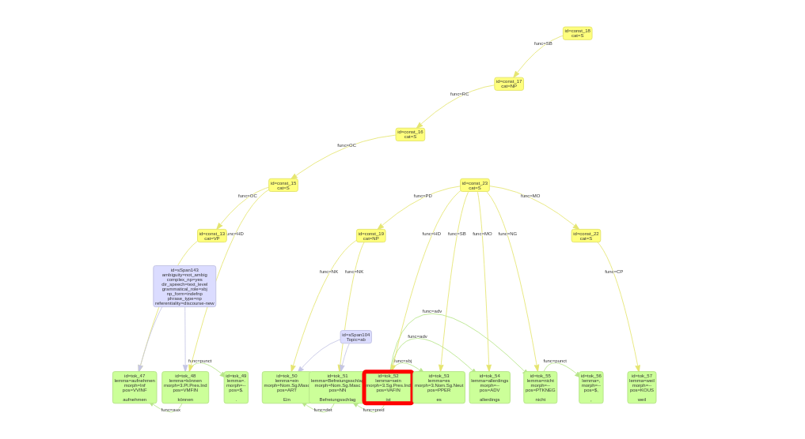

Visualization of salt model {#visualizer}
====

Salt's [VisJsVisualizer](\ref org.corpus_tools.salt.util.VisJsVisualizer) provides a possibility to create a html file, which visualizes a salt graph, created from an [SDocument](\ref org.corpus_tools.salt.common.SDocument) or from an 
<a href="http://download.eclipse.org/modeling/emf/emf/javadoc/2.4.3/org/eclipse/emf/common/util/URI.html"> org.eclipse.emf.common.util.URI</a> of a salt file, using the vis.js library from <a href="http://visjs.org"> visjs.org</a>. 
Furthermore it allows to filter nodes and/or relations of salt document. Therefore you have to implement the [ExportFilter](\ref org.corpus_tools.salt.util.ExportFilter). If no export filter used, all nodes and all relations but textual relations will be visualized.

A simple way to use VisJsVisualizer for writing the html file is shown in the following example code.
 ~~~{.java} 
  String inputSaltFile = "path_to_your_salt_file"; 
  
  String outputFolder = "path_to_your_output_folder";
  
  URI uri = URI.createFileURI(inputSaltFile);
  
 	VisJsVisualizer visJsVisualizer = new VisJsVisualizer(uri);
 	
 	try {
 		 URI outputFileUri = URI.createFileURI(outputFolder);
 		 
 		 visJsVisualizer.visualize(outputFileUri);
 		 
 	} catch (IOException | XMLStreamException e) { 
 	
 		e.printStackTrace();
 		
 	}
 
~~~

How already mentioned, we also can instantiate the visualizer from an SDocument. The following example code demonstrate such a case. We use the sample document, generated by [SampleGenerator](\ref org.corpus_tools.salt.samples.SampleGenerator).

 ~~~{.java} 
//generate sample salt document

SDocument doc = SaltFactory.createSDocument();

SampleGenerator.createDocumentStructure(doc);
	
//instantiate a visualizer

VisJsVisualizer visJsVisualizer = new VisJsVisualizer(doc);

try { 

	//define output path and instantiate an output uri
	
	String outputFolderPath = "tmp/my_salt_test/sample_doc";
	
	File testFolder = new File(outputFolderPath);
	
	URI outputFolderUri = URI.createFileURI(outputFolderPath);		
	
	//visualize sample doc
	
	visJsVisualizer.visualize(outputFolderUri);
	
} catch (IOException | XMLStreamException e) { 

 		e.printStackTrace();
 		
}
~~~

While execution of above code the visualizer organizes a file structure as shown below.  After execution you can view the visualization of the salt document in the generated saltVisJs.html file. The rest of files and directories has an auxiliary character and is necessary to create the visualization.

The following image demonstrate the entire salt graph of the sample document from generated saltVisJs.html file. The background colors green, blue and yellow are always associated with token nodes, spanning nodes and structure nodes respective. Note, spanning nodes will be divided into classes according to their annotation keys. All spanning nodes belonging to the same class appear in the same level.

#### Export Filter

In order to filter nodes and/or relations you need to implement the interface [ExportFilter](\ref org.corpus_tools.salt.util.ExportFilter). It provides two methods:

 ~~~{.java} 
//returns a boolean to indicate, whether the specified node must be included
public boolean includeNode (SNode node);

//returns a boolean to indicate, whether the specified relation must be included
public boolean includeRelation (SRelation relation);
~~~

Please note, token nodes will always been visualized, so that export filter has no impact on them.
 
#### Style Importer

The interface [StyleImporter](\ref org.corpus_tools.salt.util.StyleImporter) allows to highlight the nodes. Therefore you have to implement the sole method of the interface:

 ~~~{.java} 

//returns the hexadecimal RGB representation of a color in the format "#rrggbb" for the specified node
  
public String getHighlightingColor (SNode node);
~~~

The border of the highlighted node will be colored according to returned color. The next image demonstrates a salt graph with a highlighted token node.

