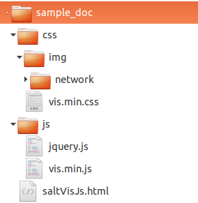
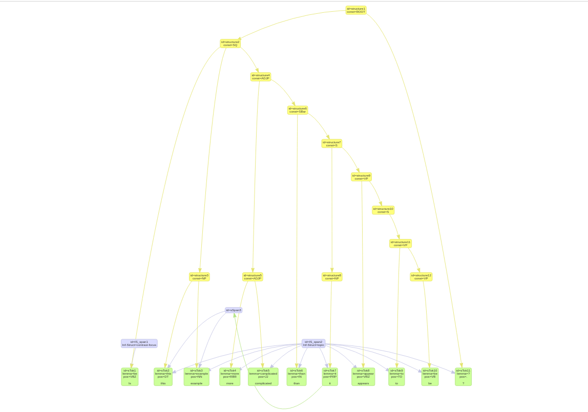

Visualize salt model {#visualizer}
====

Salt's [VisJsVisualizer](\ref org.corpus_tools.salt.util.VisJsVisualizer) provides a possibility to create a html file, which visualizes a salt graph, created from an [SDocument](\ref org.corpus_tools.salt.common.SDocument) or from an [URI](\ref org.eclipse.emf.common.util.URI) of a salt file, using the vis.js library. Furthermore it allows to filter nodes and/or relations of salt document. Therefore you have to implement the [ExportFilter](\ref org.corpus_tools.salt.util.ExportFilter). If no export filter used, all nodes and all relations but textual relations will be visualized.

A simple way to use VisJsVisualizer for writing the html file is shown in the following example code.
 ~~~{.java} 
  String inputSaltFile = "path_to_your_salt_file"; 
  String outputFolder = "path_to_your_output_folder";
  URI uri = URI.createFileURI(inputSaltFile);
 	VisJsVisualizer visJsVisualizer = new VisJsVisualizer(uri);
 	try {
 		 URI outputFileUri = URI.createFileURI(outputFolder);
 		 visJsVisualizer.visualize(outputFileUri);
 	} catch (IOException | XMLStreamException e) { 
 		e.printStackTrace();
 	}
 
~~~

How already mentioned, we also can instantiate the visualizer from an SDocument. The following example code demonstrate such a case. We use the sample document, generated by [SampleGenerator](@ref org.corpus_tools.salt.samples.SampleGenerator), which is described here (@ref #sample).

 ~~~{.java} 
//generate sample salt document
SDocument doc = SaltFactory.createSDocument();
SampleGenerator.createDocumentStructure(doc);
	
//instantiate a visualizer
VisJsVisualizer visJsVisualizer = new VisJsVisualizer(doc);

try { 
	//define output path and instantiate an output uri
	String outputFolderPath = "tmp/my_salt_test/sample_doc";
	File testFolder = new File(outputFolderPath);
	URI outputFolderUri = URI.createFileURI(outputFolderPath);		
	//visualize sample doc
	visJsVisualizer.visualize(outputFolderUri);
} catch (IOException | XMLStreamException e) { 
 		e.printStackTrace();
}
~~~

After execution the visualizer organizes a file structure as shown below.

|| |

The following image demonstrate a fragment from saltVisJs.html file.

