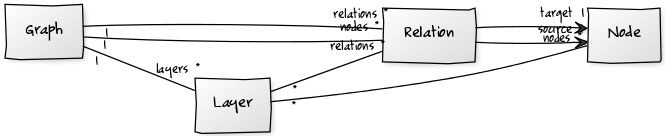

# What is a Salt?

As already mentioned, Salt is a graph based model, therefore we expanded
the graph structure presented in [What is a graph?](what-is-a-graph.md) with
layers and labels and the mechanism to label a graph, a node, a
relation, a layer or another label. The expanded graph structure is
given by 

$$ G=(V, E, L, {label_a, ... label_b}) $$ 

with:
-   \\( V \\) being a set of nodes with \\( v= ({label_c, ... label_d}) \in V \\)
-   \\( E \\)  being a set of directed relations with \\( e = (v_1 \in V, v_2 \in V,
    {label_e, ... label_f}) \in E \\)
-   \\( L \\) being a set of layers with \\( l= (V_1 \subseteq V, E_1 \subseteq E, L_1 \subseteq L, {label_g,.. label_h}) \in L \\)
-   and a set of labels \\( {label_a, ... label_b} \\) the graph is labeled
    with.

Each label is defined as \\( label_y = (namespace, name, value,
{label_k,\...label_l}) \\).

A layer is a grouping mechanism for nodes and relations, and can also
contain further layers (called sub layers). The containment relation
implements a recursive structure for layers, to build hierarchies. In
general this mechanism enables the creation of sub graphs. But note that
a layer cannot be contained by itself, so cycles of layers are not
possible.

A label is an attribute-value-pair contained in either a node, a
relation, a graph, a layer or another label. The attribute-value-pair
mechanism is realized by two components, a naming component and a value
component. The naming component must be unique for one object and
consists of the two values namespace and name. We expand the naming
component with a namespace attribute to enable the possibility of adding
more than one label with the same name to one graph, node etc. Now an
object can have two labels with the same name but different namespaces.
The value component is simpler and is just the value itself. The values
of namespace and name are restricted to be a String value, whereas the
value is unbound and can be in principle anything.

At last we want to regard Salt from a modelling point of view. 
The following figure shows the base model, that we used for
our abstraction for linguistic data. 

The figure shows, the above defined
elements and their connection to each other. In Salt, we call a node
`SNode`, a relation `SRelation`, a layer `SLayer` and a graph `SGraph`.
When you take a look at figure, you might wonder, what the attribute
`sType` of element `SRelation` (`SRelation.sType`) means, since it is
not introduced in the formal model and conflicts with the approach that
everything we use in Salt must be one of the graph elements. Don\'t
worry about, in fact the `sType` is even a label on a relation. We
herefore used a specific type of label, the `SFeature` element which is
described in detail in [Annotations and label mechanism](#annotations-and-label-mechanism).
Since relations do not always need an attribute-value pair, the `sType`
attribute for relations is a very useful mechanism for linguistic data.
Sometimes it is enough to flag a relation being a specific type. If this
sounds too abstract for now don\'t worry we give detailed examples in
[Loose relation](how-does-salt-work/document-structure.md#loose-relation) and
[Hierarchies](how-does-salt-work/document-structure.md#hierarchies). 
The next section describes labels as model elements, which in Salt is called `SLabel`, and
the connection between such a label and the other model elements.

## Annotations and label mechanism

Generally spoken, an annotation is an interpretation of primary data
(see [Primary data](how-does-salt-work/document-structure.md#primary-data)). 
In Salt, we differentiate this
abstract form of annotation into a \"structural\" and a \"semantic\"
part. Imagine for instance a syntax tree. In Salt, the tree itself,
which is modeled by nodes and relations, belongs to the structural part,
whereas the assignment of a node or a relation to a category like being
a sentence, a noun phrase etc. belongs to the semantic part. The
semantic part is realized by labeling a node or a relation for instance
by adding a label with the name \'*cat*\' and value \'*S*\' (following
the TIGER scheme[^5], where \'*cat*\' stands for category and \'*S*\'
for sentence). Note that such a tagset is not part of Salt. Salt is poor
in semantics, which means you can use every tagset you like.

We further differentiate between a linguistic annotation and a meta
annotation. A linguistic annotation defines a structural element as a
specific linguistic category. A meta annotation adds linguistic and
non-linguistic information on a meta level to a structural element. For
instance language information to a primary text, information about an
annotator of a syntax tree and so on. But still both sorts of
annotations are derivates of a label and are therefore a triple
consisting of a namespace, a name and a value as shown in the following figure.

Since annotations are a core essence of linguistic work, they will be
used at various places in the following.

Next to `SAnnotation` and `SMetaAnnotation`, there are two further
subtypes of `Label`. One is `SProcessingAnnotation` and the other is
`SFeature`. The type `SProcessingAnnotation` is not part of the model,
this type could be used, to add some information to any Salt object
during a processing. So for instance you can store any state like
\'*already processed*\' or other non-linguistic and non meta annotations
like \'having the color red\'[^6] to it. Unfortunately the label
`SFeature` is a bit more complicated. The good news is, that you
normally will not need to work with it, when using the Salt API. The
`SFeature` is a mechanism to enhance our graph elements with class
attributes[^7]. We will explain this in more detail in
[Annotations](how-does-salt-work/document-structure.md#annotations). We just mention it here since we have
used the `SFeature` mechanism to model the class attribute
`SRelation.sType`.

If it is not clear what this has to do with modeling linguistic data, we
hope to make it clear in the following sections. But always keep in
mind, that everything in Salt and all its power is reducible, to the
here presented graph structure. And since the nodes and relations in
Salt are just used as placeholders, the real power - especially the
linguistic one - is in the labeling mechanism, which is widely used in
Salt as you will see in the following.

[^5]: see
    <http://www.ims.uni-stuttgart.de/forschung/ressourcen/korpora/TIGERCorpus/annotation/tiger_scheme-syntax.pdf>

[^6]: For instance if you compute the chromatic number of the linguistic
    graph.

[^7]: In UML or object oriented programming languages an attribute is
    part of a class to store a state of a class instance.
