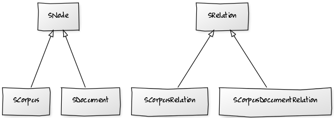
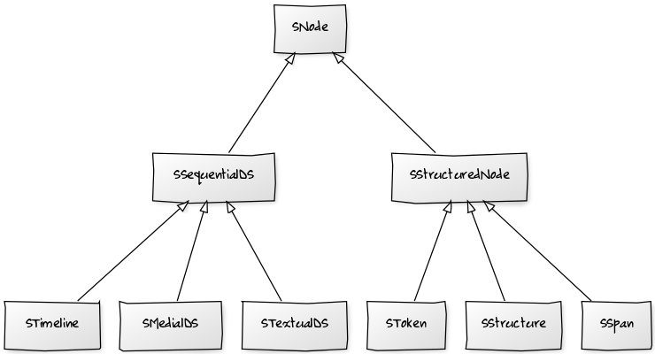
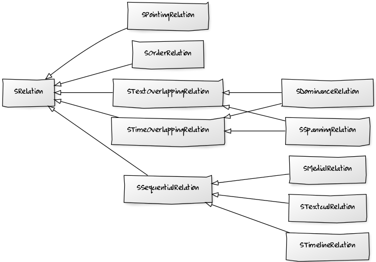

# Appendix

## Corpus-structure

**Corpus-structure (inheritance graph)**

**Overview over all elements of corpus-structure**

| element                 | short description                                                                                              |
|-------------------------|----------------------------------------------------------------------------------------------------------------|
| SCorpusGraph            | A graph representing the corpus-structure itself, see [Corpus graph](how-does-salt-work.md#corpus-graph).      |
| *SNode*                 | An abstract node, from which all other nodes are derived from, see [What is Salt?](what-is-a-salt.md).         |
| SCorpus                 | A container for documents or other corpora, see [Corpus](how-does-salt-work.md#corpus).                        |
| SDocument               | A container for primary data and annotations, see [Document](how-does-salt-work.md#document).                  |
| *SRelation*             | An abstract relation, from which all other relations are derived from, see [What is Salt?](what-is-a-salt.md). |
| SCorpusRelation         | Connects a super corpus with a sub corpus, see [Corpus-structure](how-does-salt-work.md#corpus-structure).     |
| SCorpusDocumentRelation | Connects a corpus with a document, see [Corpus-structure](how-does-salt-work.md#corpus-structure).             |

## Document-structure

**Nodes of document-structure (inheritance graph)**

**Relations of document-structure (inheritance graph)**

**Overview over all elements of document-structure**

| element                    | short description                                                                                                                                                                                                                            |
|----------------------------|----------------------------------------------------------------------------------------------------------------------------------------------------------------------------------------------------------------------------------------------|
| SDocumentGraph             | A graph representing the document-structure itself, see [Corpus graph](how-does-salt-work.md#corpus-graph).                                                                                                                                  |
| *SNode*                    | An abstract node, from which all other nodes are derived from, see [What is Salt?](what-is-a-salt.md).                                                                                                                                       |
| *SSequentialDS*            | An abstract node used to model sequential datasources. Sequential here means, that you can address an interval of the datasource by determing a start and a end position.                                                                    |
| *SStructuredNode*          | An abstract node which is used for technical purposes, to constraint the kind of nodes being target of for instance SDominanceRelations, SPointingRelations.                                                                                 |
| STextualDS                 | A node representing primary texts, see [Primary data](how-does-salt-work.md#primary-data).                                                                                                                                                   |
| SMedialDS                  | A node representing audio data, see [Audio data](how-does-salt-work.md#audio-data).                                                                                                                                                          |
| STimeline                  | A common timeline for all objects in the  document-structure, for instance to model time in dialogue data. There could be only one timeline object for one document-structure. See [Time management](how-does-salt-work.md#time-management). |
| SToken                     | Smallest annotatable unit of primary data, for instance a character, syllable, word etc., see [Tokenization](how-does-salt-work.md#tokenization).                                                                                            |
| SSpan                      | A node to model sets in a graph, to collect a number of tokens and to annotate them at once, see [Spans of tokens](how-does-salt-work.md#spans-of-tokens).                                                                                   |
| SStructure                 | A node to model hierarchies, for instance for syntax trees, see [Hierarchies](how-does-salt-work.md#hierarchies).                                                                                                                            |
| *SRelation*                | An abstract relation, from which all other relations are derived from, see [What is Salt?](what-is-a-salt.md).                                                                                                                               |
| *SSequentialRelation*      | An abstract relation which provides to address an interval (start and end value) in a data source, see [Time management](how-does-salt-work.md#time-management).                                                                             |
| *STimeOverlappingRelation* | An abstract relation marking the implementing relation to be a relation, giving the overlapped time interval from its target to its source (a kind of a contrary inheritance).                                                               |
| *STextOverlappingRelation* | An abstract relation marking the implementing relation to be a relation, giving the overlapped textual interval from its target to its source (a kind of a contrary inheritance).                                                            |
| STimelineRelation          | A relation to connect a token with the common timeline, see [Time management](how-does-salt-work.md#time-management).                                                                                                                        |
| STextualRelation           | A relation to connect a token with the a primary text, see [Primary data](how-does-salt-work.md#primary-data).                                                                                                                               |
| SMedialRelation            | A relation to connect a token with the a audio data object, see [Audio data](how-does-salt-work.md#audio-data).                                                                                                                              |
| SSpanningRelation          | A relation used to create a set in a graph, this is used to connect a token with a span object, see [Spans of tokens](how-does-salt-work.md#spans-of-tokens).                                                                                |
| SDominanceRelation         | A relation to represent hierarchies, see [Hierarchies](how-does-salt-work.md#hierarchies).                                                                                                                                                   |
| SPointingRelation          | A loose relation to connect each kind of node with another one, see [Loose relation](how-does-salt-work.md#loose-relation).                                                                                                                  |
| SOrderRelation             | A relation to create an explicit order of tokens, see [Ordering tokens](how-does-salt-work.md#ordering-tokens).                                                                                                                              |

