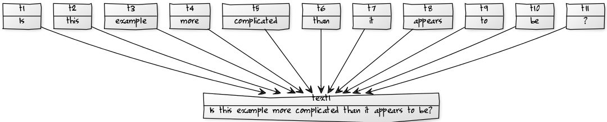

# Document-structure

In contrast to the corpus-structure, the document-structure covers the
\"real\" linguistic data, which means primary data, linguistic
structures and annotations above them. The linguistic structure contains
the nodes: `SSequentialDS`, `STextualDS`, `SMedialDS`, `SToken`, `SSpan`
and `SStructure` and the relations: `STextualRelation`,
`SMedialRelation`, `SSpanningRelation`, `SDominanceRelation`,
`SPointingRelation` and `SOrderRelation` which we will discuss in the
following. All these nodes and relations are contained in a graph, the
`SDocumentGraph`, which is the model element representing the
document-structure.

As a quick reference in the [appendix](../appendix.md#document-structure) gives a short
description and an overview of the inheritance hierarchy of the elements
being part of the document-structure.

## Primary data

The primary data in linguistics are the center and the beginning of each
annotation process. Every piece of language is a primary date. This
includes textual data, audio-video data etc. . A special subtype of
primary data is the primary text, which only covers textual data. Since
in linguistics the term and the meaning of primary data and especially
primary text is controversial, we here use primary data as the first
digitalisation of data which comes into a Salt model.

So now the question is how to realize primary data in a graph based
world. And the answer is: with graph elements, or more precisely with
nodes and labels. In Salt, a specific node of type `SSequentialDS` is
used as a placeholder for a primary date. The real data itself is added
to that node with a label having the name `data` and the namespace
*salt*. The same goes for each subtype of `SSequentialDS`, so for
instance for the type `STextualDS` which represents primary texts in
Salt, see the following figure.

The actual primary text (like for example \'*Is
this example more complicated than it appears to be?\'*) is stored as the
value of the shown `SFeature`.

## Tokenization

In general, it is not totally clear in linguistics what a token is. In
most interpretations the term is used synonymously with \'word\' (in the
sense of graphmatics). But even here, the question what a word is, is
controversial. Therefore we here use a more technical definition of what
a token is. In Salt a token is the smallest countable unit of primary
data. For instance in a primary text, a token could be a set of
characters, just one character or even an empty character. This allows
us, to use tokens free of a semantical interpretation. A token now can
be a word, a syllable, a sentence or any other textual categorization.

The Salt element representing a token is the type `SToken`, a
specialization of the type `SNode`. Such a `SToken` object is a
placeholder for annotations and a target for interlinking. The `SToken`
object itself does not contain any information about the overlapped
primary data. In case of the primary data being text, this is realized
with a specific type of `SRelation`, the `STextualRelation`. A
`STextualRelation` links a primary text (as source) with a token (as
target).

A `STextualRelation`
further contains two labels (or more precisely `SFeature` objects)
representing the start and the end position determining the interval of
the primary text overlapped by the token. These labels are of type
`SFeature`.

 
E.g. a tokenization of the primary text \'*Is this example more complicated
than it appears to be?*\' can be modeled in Salt as follows.

## Annotations

In the last sections we showed how to model the \"structural\" part of
annotations (we have often called it placeholder). Now we want to give
an impression of how to do the \"semantic\" part. Therefore we pick up
the sample used in [Tokenization](#sec_tokenization) and especially its
tokenization. We want to enhance the tokenized words with part-of-speech
annotations. We already introduced the labeling mechanism in
[Annotations and label mechanism](#sec_labeling). Now we want to make
use of it by adding a `SAnnotation` object to each token having the
`name` \'*pos*\' and the corresponding part-of-speech value as `value`.
[figure\_title](#fig_sample_token_annotation) shows the annotation for
the previous used tokenization sample.Each of these annotations are
reducible to labels of type `SAnnotation` and
[figure\_title](#fig_sample_token_annotation_pos) exemplifies the
annotation of token t~1~ covering the text \'*is*\' with a
part-of-speech annotation. We here exemplified the creation of
annotations by annotating tokens with part-of-speech annotations. But
remember, that Salt is not bound to a specific set of annotations or
tagsets. This means, you can use any kind of annotations with the same
machanism. Furthermore adding an `SAnnotation` is not bound to tokens.
Also any `SNode`, `SRelation`, `SLayer`, `SGraph` and even `SAnnotation`
can be annotated in this way.

## Spans of tokens

A span is used to group a couple of tokens together to give them exactly
the same annotation or to connect them as a bunch with a 3rd node at
once. A span therefore has the semantic of an ordered set. In a graph
based world, we need to model such an ordered set as nodes and
relations. Therefore Salt provides the node type `SSpan` and the
relation type `SSpanningRelation`. A `SSpan` object represents the span
itself and for instance could be annotated or linked with other nodes.
To realize the containment of tokens in a span, each token is connected
with the span with a separate `SSpanningRelation` object, see
[figure\_title](#fig_model_span). A `SSpanningRelation` always has a
span as source and a token as target.

Imagine a piece of a primary text like \'*New York*\' and two tokens
*t~1~* (representing \'*New*\') and *t~2~* (representing \'*York*\').
For annotating them as an entity, you can create a span *s~1~* and
connect *t~1~* with *s~1~* via one `SSpanningRelation` *r~1~* and *t~2~*
with *s~1~* via a second `SSpanningRelation` *r~2~* as shown in
[figure\_title](#fig_sample_span). Since a `SSpan` is just a node, it
can be further annotated for instance with an annotation \'*entity=
city*\'. Spans can even be very helpful to annotate bigger parts of the
primary text, for instance to annotate information structure or foreign
language parts etc. . Also a `SSpanningRelation` can carry further
annotations, but this is rather unusual since such a relation has no own
linguistic semantics and is just a technical mechanism to model ordered
sets in a graph.

## Hierarchies

Hierarchies are a useful mechanism in linguistics to express a complex
structure behind the surface of a text. For instance, a widely used
mechanism to describe phrase structures are syntax trees. The term
syntax trees implies that these hierarchies are trees, even in a graph
sense. This means, they consist of nodes and relations and are therefore
easy to model in Salt. Salt offers a specific type of node, the
`SStructure`, and a specific type of relation, the `SDominanceRelation`.
The source of an `SDominanceRelation` could be a `SToken`, `SSpan` or
even a `SStructure` as shown in [figure\_title](#fig_model_hierarchie).
The unit of both elements enables to create unbound hierarchies above a
tokenization.

{width="100"}

The meaning of the type `SDominanceRelation` is a part-of relation. In
contrast to the `SSpan` and the `SSpanningRelation`, a `SStructure` is
not just a placeholder for a bunch of `SToken` objects, it is a proper
element itself. The same goes for `SDominanceRelation` objects. For
instance, in many cases it makes a linguistic difference whether tokens
*t~1~*, *t~2~* and *t~3~* are directly dominated by a structure *s~1~*
or whether *t~1~* and *t~2~* are dominated by a structure *s~2~* which
is, together with *t~3~*, dominated by structure *s~2~*, see
[figure\_title](#fig_sample_hierarchie1) and
[figure\_title](#fig_sample_hierarchie2).

{width="100"}

{width="100"}

## Loose relation

Sometimes it is necessary to set objects into a very loose relationship,
as a kind of an interlinking, which does not influence the objects
themselves. Such a relation is the type `SPointingRelation`. A pointing
relation in Salt allows to relate any kind of nodes with each other. In
general, this type of relation has no semantics and could be used for a
wide range of annotations, which does not group or structure nodes. For
instance, this could be very helpful for a dependency analysis or
coreferential chains etc. .

To give an example, imagine the text \'*John was a big man \... he
always had to move his head*\', where \'*John*\' (token *t~1~*) and
\'*he*\' (token *t~i~*) refer to the same entity. To express that in
Salt, you can create a `SPoiningRelation` object having the `sSource`
*t~1~* and the `sTarget` *t~i~*, or the other way around. Now let\'s
extend this example and imagine the text \'*John Doe \... he*\', with
the tokens *t~1~* (\'*John*\'), *t~2~* (\'*Doe*\') and *t~i~*
(\'*he*\'). In this case, we want to set \'*John Doe*\' as a whole in
relation to \'*he*\'. This is possible by creating a `SSpan` object
*s~1~* containing *t~1~* and *t~2~* and relating the token *t~i~* via a
`SPointingRelation` object to *s~1~*.

To determine a `SPointingRelation` being a coreferential relation or a
dependency, you should use the `sType` attribute which is available for
every `SRelation`. Like all the other relations, `SPointingRelation` can
be annotated to express some linguistic semantics.

## Layer {#sec_layer}

A layer is a simple grouping mechanism for bundling nodes and relations
to a set. In graph theory, a layer is equivalent to a subgraph. Such a
layer could be very helpful for linguistic data to distinguish between
several kinds of annotations or annotation graphs. Imagine for instance
a document-structure containing a set of tokens and a syntax tree. Now
it might be helpful for your model to distinguish between these nodes.
For instance when you group the tokens to a morphological layer and the
nodes, being part of the syntactic tree, are grouped to a syntactic
layer. Now you might ask: \"Why should I? I can distinguish them by
their type\". And you are right in that case. But when nodes belong to
the same type, but to different semantics, you need an explicit grouping
mechanism. Imagine a set of spans annotating the information structure
of a text and another set of spans annotating the topological fields.

In Salt, each node and each relation can belong to an unbound number of
layers. Furthermore, a layer can also contain another layer. For
instance a syntactic layer can contain a morphological layer. This makes
all tokens being part of the syntactic layer as well. A layer is
represented with the element `SLayer`, has a name and can be annotated
in the same way as nodes and relations can be.
[figure\_title](#fig_sLayers) shows the relationship between layers
nodes and relations in Salt.

## Multiple primary texts 

On the example of parallel texts

A lot of corpus projects in linguistics are more complex than handling
just one primary text. They address parallel data dealing with multiple
texts, for instance to compare different languages, different historical
stages of language or to handle dialogue data with multiple speakers. In
Salt the number of primary texts (element `STextualDS`) or primary data
(element `SSequentialDS`) is not limited.

We want to demonstrate the use of multiple texts by creating a parallel
corpus for the languages English and German. Demonstrations how to model
dialogue data please find in [Time management](#sec_time) and [Ordering
tokens](#sec_order). Imagine the primary text \'*Is this example more
complicated than it appears to be?\'* and its German counterpart \'*Ist
dieses Beispiel komplizierter als es zu sein scheint?*\'. Creating two
`STextualDs` objects \'*text1*\' and \'*text2*\' each containing one of
the texts is rather simple[^8]. The more interesting question is how to
align the single words as being translations of each other. In case you
are not so familar with German[^9], we here present the translation
alignment for the tokenized texts (for an easier alignment, we switched
the words at the end a little):

    Is    this     example    more complicated   than   it   appears   to   be?
    Ist   dieses   Beispiel   komplizierter      als    es   scheint   zu   sein?'

Next to the fact, that English and German are sometimes very close to
each other and for our example mostly have a word to word translation,
we also have one case, where the two English words \'*more
complicated*\' are translated to a single German word
\'*komplizierter*\'.

To bring two tokens for instance *t~1e~* and *t~1g~*[^10] in relation to
each other, you can create a `SPointingRelation` *r~1~* which\'s source
is *t~1e~* and target is *t~1g~*. Now they are connected, but more in a
technical than in a semantic sense. To add the linguistic meaning to
that relation, you can use the `sType` attribute and add for instance
the type \'`translation`\'. For such a sample, our linguistic intention
to determine that *t~1e~* is the translation of *t~1g~* and even the way
around, the graph structure differs in detail. As our graph is a
directed graph, we do not really have such a bidirectional relation.
Depending on the interpretation of the corpus, it might be useful to
create a second relation having *t~1g~* as source and *t~1e~* as target
and to mark both relations as being either \'*trans\_en\_de*\' or
\'*trans\_de\_en*\'.

Now coming to the more complex case of aligning the tokens *t~4e~*
(\'*more*\'), *t~5e~*(\'*complicated*\') with *t~4g~*
(\'*komplizierter*\'). To realize such an 1:n translation, we recommend
using a span. With a span *s~1e~* you can group the tokens *t~4e~* and
*t~5e~*. This allows to use *s~1e~* as source of the `SPointingRelation`
and the token *t~4g~* as its target.

If your individual case is even more complicated and needs to realize a
n:m translation, just use spans on both sides. Group the tokens of the
first language to a span and group the tokens of the second language to
a span. Then connect the span on the one side with the tokens on the
other side with a `SPointingRelation`.

In our sample we used just two languages for a better readability. Note
that Salt is not bound to a fixed number of primary texts, which allows
to model as many parallel texts with as many relations between their
tokenizations as you like. For a well-arranged model, you can group all
tokens and the primary text belonging to one language into one layer.
Then you can set `SLayer.setName()` to the name of the language.

## Time management

On the example of dialogue data

In this section, we address the time management in Salt. But what does
it mean, time management? Remember, Salt is poor in semantics, so time
management does not address the chronological progression of a text like
\"**Before** Bart went to school, he stood up.\"[^11] With time
management we mean the fact of ordering tokens in a primary text along
their temporal occurance. This often becomes necessary when dealing with
multiple texts. In Salt this is handled by introducing a global[^12]
unique timeline which is connected with each token.

A lot of linguistic projects do not only address written texts, they
further annotate spoken data. Spoken data differs in two areas from
written data. First, the data source differs, since the primary data of
spoken data is mostly an audio or video stream. Since Salt was developed
for covering textual data, for now, we expect that there is also a
textual representation of the audio or video data. But nevertheless Salt
also allows to represent such data. This mechanism is addressed in
detail in [Audio data](#sec_audioData). Second, in many cases we do not
have one continuous text, since there are multiple speakers, which might
speak at the same time. We recommend modelling each text, belonging to
one speaker, in a separate `STextualDS` object[^13]. To give a more
concrete example, imagine the following two texts produced by speakers
\'*spk1*\' and \'*spk2*\': This sample shows the tokenized two texts and
the correspondance of each token to an interval in the timeline. For
instance the token \'*Is*\' (*t~1~*) of speaker \'*spk1*\' corresponds
to an interval starting at 0 and ending at 1[^14]. Since we are in a
graph world, this needs to be modeled by nodes, relations and labels.
Therefore, the `STimeline` is a subtype of `SNode` and the
`STimelineRelation` is a subtype of `SRelation` having two attributes
(`SFeature` objects) `start` and `end` determining the start and end of
the time interval. This is shown in [figure\_title](#fig_time) This
mechanism is quite simple, since it is the same mechanism that connects
a token to a primary text. It might become more interesting in case of
the time interval between 7 and 9. In that interval the text of *spk1*
covers the two tokens *t~spk1\_8~* (\'*appears*\')and *t~spk1\_9~*
(\'*to*\'), and the text of *spk2* just covers the token *t~spk2\_1~*
(\'*Uhm*\'). But modelling this is also very straight forward, because
you can connect them via three `STimeRelation` objects: 1) *t~spk1\_8~*
with the interval \[7, 8\], 2) *t~spk1\_9~* with the interval \[8, 9\]
and 3) *t~spk2\_1~* with the interval \[7, 9\]. With these abstract
points-of-time (like 1,2,3,4, \...), it is possible to set an unbound
number of tokens in relation to the common timeline. But note, in each
document-structure there can be only one `STimeline` object.

## Ordering tokens

In this section we address the order of tokens in one or multiple texts.
In a single ordinary primary text, the order might not be an issue,
since the natural order of tokens is along their occurence in the
primary text. In a Salt model all tokens are contained in a single list,
which is sorted by their insertion. Imagine a primary text \'*This is a
sample*\' tokenized in 4 tokens. If token *t~3~* (\'*a*\') was inserted
into the list before token *t~2~* (\'*is*\') was inserted, the order of
the list would be *t~1~*, *t~3~*, *t~2~*, *t~4~*. In that case, the list
could be reordered in temporal order, which means along the offset in
primary text (`STextualRelation.sLeft`). But what is with multiple
texts? If we have multiple texts and order the corresponding tokens by
their textual offset, we will end up with a mixed list of tokens of both
texts. Imagine a second text \'*What a nice sample*\' also tokenized
into 4 tokens *t~21~*, *t~22~*, *t~23~* and *t~24~*. The token list
ordered by the textual offset would be the following useless list:
*t~1~*, *t~21~*, *t~2~*, *t~22~*, *t~23~*, *t~3~*, *t~4~*, *t~24~*. A
second option is the ordering by the offset in the timeline. Imagine
both primary texts as a dialogue between two persons, with the following
temporal order.

  ------- ------ ------ --- -------- --------
  spk1:   This   is     a   sample   
  spk2:          What   a   nice     sample
  ------- ------ ------ --- -------- --------

  : Both texts as a dialogue.

This could result in: *t~1~*, *t~2~*, *t~3~*, *t~21~*, *t~4~*, *t~22~*,
*t~23~*, *t~24~*.[^15] This list now represents the temporal order, but
the tokens are also mixed in sense of the correspondance to the primary
texts. So it depends on what you want to do with the data, to know which
order might be the best.

Another way of ordering the tokens is an explicit order via the specific
relation `SOrderRelation`. This relation allows to relate the node types
`SToken`, `SSpan` and `SStructure`. With this relation you can create a
path through the graph to represent any kind of order. But note, this
path must be acyclic. When setting the `sType` of that relation, you can
name the path. To give an example, imagine the text \'*The streets of
New York*\' and a tokenization of t~1~ (\'*The*\'), t~2~
(\'*streets*\'), t~3~ (\'*of*\'), t~4~ (\'*New*\') and t~5~
(\'*York*\'). Since you may want to annotate t~4~ and t~5~ as one word,
you can create a span s~1~ containing both tokens. A path of wordforms
given by `SOrderRelation`s could now be: t~1~, t~2~, t~3~, s~1~ as shown
in [figure\_title](#fig_order_path) Another use case for
`SOrderRelation` objects are parallel tokenizations. For instance a
tokenization of characters or letters and one by word forms. Here it may
make sense, to create two pathes, one for the characters and one for the
word forms as shown in [figure\_title](#fig_order_path2).

## Audio data

Next to pure textual data like news paper articles, essays, internet
chats etc. linguistics is also interested in spoken data like dialogues
etc. . Even if Salt is a text based model, it can also deal with audio
data. Audio data can be modeled as annotations or primary data. To
create an audio annotation, the `SAnnotation.setValue()` must be set to
an URI pointing to the audio file. To use audio data as primary data,
Salt contains the model elements `SMedialDS` and `SMedialRelation`.
These elements are very similar to the elements `STextualDS` and
`STextualRelation`. The element `SMedialDS` is also derived from the
element `SSequentialDS`, it provides the field `sMediaReference` which
contains a URI referring to an audio file. With an object of type
`SMedialRelation`, we now can connect such audio data with a token. To
address a range in the entire audio stream, the element
`SMedialRelation` contains the fields `start` and `end` to address the
beginning and the end of that range as shown in
[figure\_title](#fig_sAudioData). For instance to address a range
beginning at 00:00:00 and ending 00:00:01. Since one second could be
very long for spoken data, the start and end value is a very fine
granular floating point number with a precision of 64-bit IEEE 754.[^16]

Since Salt expects a textual transcription corresponding to audio data
it is necessary to connect a token with first the audio data, second the
primary text and eventually third the timeline. Imagine the primary text
\'*Is this example more complicated than it appears to be?*\', which is
tokenized by words and a corresponding audio file.
[figure\_title](#fig_audioSample) shows the relation of the token *tok1*
(just as a sample), the primary text *text1* and the audio date *audio1*
via the `STextualRelation` object *textRel1* and the `SMedialRelation`
*sAudioRel1*.

In Salt, the number of `SMedialDS` objects a model can have is not
restricted and you can add as many of them as you like.

You can also combine the use of multiple audio and textual primary data
with the use of the common timeline. The use of the timeline allows you
to model the temporal order of tokens in such a case. This could be very
useful in case of you have to model a dialogue, where each speaker is
represented by an own audiofile and a separate transcription. With the
timeline you can align the tokens in temporal order to each other.
Imagine a dialogue consisting of two speakers, an audio recording for
each speaker *audio1* and *audio2* and a corresponding transcription to
each audio recording *text1* and *text2*. To connect the tokens with the
common timeline, you just need a `STimeRelation` having the token as its
source and the timeline as its target. For more information on that see
[Time management](#sec_time).

## Names and Ids {#sec_id}

In Salt each node, relation or layer can have a name. Each of these
objects contains a field `name` (which is a String value). The `name` is
added using the `SFeature` mechanism (see
[Annotations](#sec_annotation)). In Salt, there are no restrictions on
that name, it even does not have to be unique. Because of that, the
`name` could not reliably be used to identify exact a single object in
Salt.

To identify objects, in Salt each object (except a label and therefore
all types of annotations) provides a unique identifier, the
`Identifier`. This identifier is unique for the whole document-structure
or corpus-structure and is created by the containing graph object. An
`Identifier` object is structured as an URI having the scheme *salt* and
using segments for single Salt objects. Such a segment is given by the
`name` of an object, if that name is unique. If not it is extended by an
artificial counter to make it unique. In the corpus-structure, the
`Identifier` represents the path from the root corpus to a specific
object (`SCorpus` or `SDocument`). For instance imagine the
corpus-structure shown in [figure\_title](#fig_sample_selementId) This
corpus-structure results in the following `Identifier` objects:

  -----------------------------------------------------------------------
  salt:/corp1

  salt:/corp1/corp2

  salt:/corp1/corp2/doc1

  salt:/corp1/corp2/doc2

  salt:/corp1/corp3

  salt:/corp1/corp3/doc3

  salt:/corp1/corp3/doc4
  -----------------------------------------------------------------------

  : `Identifier`s corresponding to
  [figure\_title](#fig_sample_selementId).

An `Identifier` corresponding to an object which is contained in a
document-structure, is the `Identifier` object of the document plus a
fragment for the unified `name` of that object. For instance token
*tok1* contained in document *doc1* gets the id:
*salt:/corp1/doc1\#tok1*. A second token also having the name *tok1*
gets the id: *salt:/corp1/doc1\#tok1\_1*.

[^8]: Each primary text is is stored in the attribute `STextualDS.text`,
    see [Primary data](#sec_primData)

[^9]: By the way what is a pity.

[^10]: Where e stands for English and g for german

[^11]: The modeling of such semantic issues is up to the user, for
    instance the ISO approach of ISO-TimeML covers things like that.

[^12]: Global here means global for one document-structure.

[^13]: In section [Multiple primary texts](#sec_multipleTexts) we
    discussed the mechanism to model multiple primary texts in Salt.

[^14]: In Salt the interval borders are also known as point-of-time.

[^15]: Note, for two identical time intervals it is not clear, which
    token comes first.

[^16]: A start value of 0.0 and a end value of 1.0 represents one second
    and an end value of 0.001 represents one millisecond.
