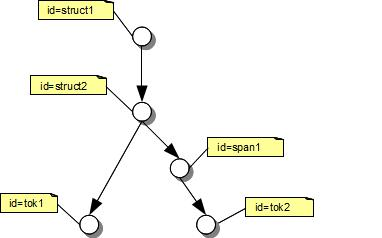

### Traversing graphs

When working with Salt, it is often necessary 

* to discover the entire graph, or 
* to discover a sub graph covered by a given node, or 
* to discover a sub graph connected by specific types of relations. 

For all of these purposes, we offer the generic possibility to traverse a graph object (e.g. a [SCorpusGraph](@ref org.corpus_tools.salt.common.SCorpusGraph) or a [SDocumentGraph](@ref org.corpus_tools.salt.common.SDocumentGraph) object). 

A traversal can be done in two directions: __top-down__ and __bottom-up__. When using the top-down method, the traversal will follow the relation direction (e.g. _a_ -> _b>_: node _a_ will be visited first, followed by node _b_). When using the bottom-up method, the traversal will follow the inverse of the relation direction (e.g. _a_ -> _b_: node _b_ will be visited before node _a_).

Additionally, you can choose the order in which nodes will be traversed. For this, we provide two modes: __depth-first__ and __breadth-first__. In depth-first mode, the sub-graph of node _b_ will be traversed, before its siblings will be visited. Imagine the following tree structure: 
<pre>
   a
 /   \
 b   d
 |
 c
</pre>

In this case, node _d_ will be visited after _a,b,c_ have been visited. In  breadth-first mode, the order of the traversal is the other way around, i.e.  the nodes _a,b,d_ will be visited before node _c_.

To define the behavior of a traversal, we provide these types, which are combinations of the direction and the order of a traversal:

* org.corpus_tools.salt.core.GRAPH_TRAVERSE_TYPE.TOP_DOWN_DEPTH_FIRST
* org.corpus_tools.salt.core.GRAPH_TRAVERSE_TYPE.TOP_DOWN_BREADTH_FIRST
* org.corpus_tools.salt.core.GRAPH_TRAVERSE_TYPE.BOTTOM_UP_DEPTH_FIRST
* org.corpus_tools.salt.core.GRAPH_TRAVERSE_TYPE.BOTTOM_UP_BREADTH_FIRST

The traversal mechanism uses a callback, therefore you need a class implementing the interface [GraphTraverseHandler](@ref org.corpus_tools.salt.core.GraphTraverseHandler). This interface declares the following three methods, which need to be implemented:

~~~{.java}
public boolean checkConstraint( GRAPH_TRAVERSE_TYPE traversalType, 
                                String traversalId,
                                SRelation relation, 
                                SNode currNode, 
                                long order);

public void nodeReached(        GRAPH_TRAVERSE_TYPE traversalType, 
                                String traversalId,
                                SNode currNode, 
                                SRelation relation, 
                                SNode fromNode, 
                                long order);

public void nodeLeft(           GRAPH_TRAVERSE_TYPE traversalType, 
                                String traversalId,
                                SNode currNode, 
                                SRelation relation, 
                                SNode fromNode, 
                                long order);
~~~

When the traversal reaches a new node, the method _checkConstraint(...)_ is called. It checks whether the following nodes and their sub-graphs should be processed any further. When this method returns true, the method _nodeReached(...)_ is called next. Before a node is left, the method _nodeLeft(...)_ is called. Note that the order of the method invocations depends on the traversal type used.

The following example shows the order of calls for the sample graph given in the following figure.

Here, we list the callbacks in correct order in case of a depth-first traversal. We assume that the called object returns true for the method _checkConstraint(...)_ on all nodes except node _span1_. In the case of node _span1_, the _checkConstraint(...)_ method returns  false. Therefore, no _nodeReached(...)_ and _nodeLeft(...)_ method will be called for this node. Note, that the list of parameters of the functions presented here is bigger than shown, e.g. the traversing policy and the relation via which the node has been reached is given, too.

* checkConstraint(struct1)
* nodeReached(struct1)
* checkConstraint(struct2)
* nodeReached(struct2)
* checkConstraint(tok1)
* nodeReached(tok1)
* nodeLeft(tok1)
* checkConstraint(span1)
* nodeLeft(struct2)
* nodeLeft(struct1)

To start the traversal, use the following method, available in any object derived from _SGraph_ (e.g. _SCorpusGraph_ or _SDocumentGraph_):

~~~{.java}
void traverse(     List<? extends SNode> startNodes, 
                   GRAPH_TRAVERSE_TYPE traverseType, 
                   String traverseId, 
                   GraphTraverseHandler traverseHandler);
~~~
or

~~~{.java}
void traverse(     List<? extends SNode> startNodes, 
                   GRAPH_TRAVERSE_TYPE traverseType, 
                   String traverseId, 
                   SGraphTraverseHandler traverseHandler, 
                   boolean isCycleSafe);
~~~

* __startNodes__ represents a list of nodes, which shall be the entry point for traversal, 
* __traverseType__ is the combination of traversal direction and order explained above, 
* __traverseid__ is an identifier which can be used to identify the specific traversal job (this can be helpful if more than one is running at the same time) and 
* __traverseHandler__, is the object which will be used for callback. 

Additionally, you can set a flag to protect the traversal engine from running in cycles. Per default, this flag is set to __false__ and your _traverseHandler_ has to deal with cyclic graphs itself.

To traverse our sample, you can use the following snippet:

~~~{.java}
//traversing the graph in depth first top down mode beginning with its roots
docGraph.traverse(docGraph.getRoots(), GRAPH_TRAVERSE_TYPE.TOP_DOWN_DEPTH_FIRST, "td", new GraphTraverseHandler() {
			
	@Override
	public void nodeReached(GRAPH_TRAVERSE_TYPE traversalType, String traversalId, SNode currNode, SRelation relation,
			SNode fromNode, long order) {
		// TODO Auto-generated method stub
	}
	
	@Override
	public boolean checkConstraint(GRAPH_TRAVERSE_TYPE traversalType, String traversalId, SRelation relation,
			SNode currNode, long order) {
		return true;
	}

	@Override
	public void nodeLeft(GRAPH_TRAVERSE_TYPE traversalType, String traversalId, SNode currNode, SRelation<SNode, SNode> relation, SNode fromNode, long order) {
		// TODO Auto-generated method stub
		
	}
});

//traversing the graph form the tokens to the top
docGraph.traverse(docGraph.getSTokens(), GRAPH_TRAVERSE_TYPE.BOTTOM_UP_BREADTH_FIRST, "bu", new GraphTraverseHandler() {
	
	@Override
	public void nodeReached(GRAPH_TRAVERSE_TYPE traversalType, String traversalId, SNode currNode, SRelation relation,
			SNode fromNode, long order) {
		// TODO Auto-generated method stub
	}
	
	@Override
	public void nodeLeft(GRAPH_TRAVERSE_TYPE traversalType, String traversalId, SNode currNode, SRelation relation,
			SNode fromNode, long order) {
		// TODO Auto-generated method stub
	}
	
	@Override
	public boolean checkConstraint(GRAPH_TRAVERSE_TYPE traversalType, String traversalId, SRelation relation,
			SNode currNode, long order) {
		return true;
	}
}, false);
	
}
~~~
